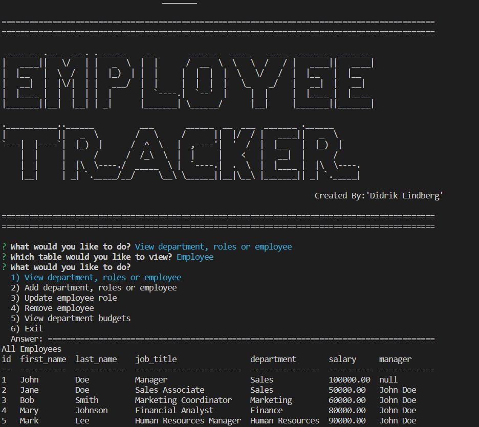

# SQL-Emplyee-Tracker

  ## Table of Contents

  * [Description](#Description)

  * [License](#license)

  * [Contributing](#contributing)

  * [Questions](#questions)

## Description
This is an app built with Node.js, Inquirer npm package, and a MySQL database, that serves as a Content Management System solution for managing company employees. It was created as a bootcamp coding assignment with a MySQL schema as the only reference. Additionally, the app uses other NPM packages including Figlet, and console.table.

## Schema

## On Start Visual

## [Walkthough Video](https://drive.google.com/file/d/1Cu3M0ckNDesj150iNwHq9yzB1vcim1JM/view)

## Licence
  

  This project is licensed under the MIT License

## Contributing
  Not accepting contributions at this time
  
## Questions  
If you have any questions about the repo, you may open an issue or [contact me directly](mailto:lindberg.didrik@gmail.com). You can find more of my work at https://github.com/DidrikLindberg